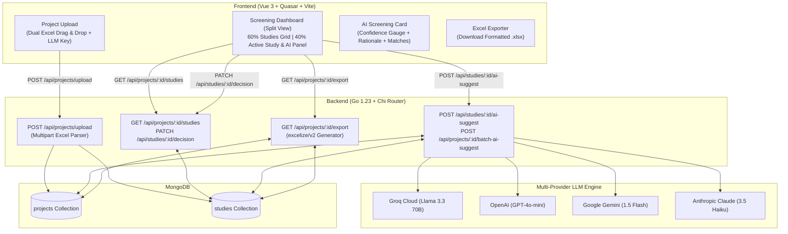

# AccuScript SLR: Literature Project Importer with Real LLM AI Screening

> **SYMPRO Developer Assignment**: Literature Project Importer with Real LLM AI Screening  
> **Tech Stack**: Go (Chi router) + MongoDB + Vue 3 + Quasar Framework + OpenAI / Groq / Gemini / Claude API

---

## 🎯 Overview

In Systematic Literature Review (SLR) workflows, researchers collect hundreds or thousands of research papers and must screen them against a predefined study protocol to determine if each paper should be **Included** or **Excluded**.

**AccuScript SLR** is a production-ready, full-stack application designed to accelerate and audit this process:
1. **Dual Excel Importer**: Upload candidate studies (`studies.xlsx`) and review criteria protocol (`protocol.xlsx`) in a single step.
2. **MongoDB Data Store**: Relational integrity with JSON-backed persistence for projects, protocols, screening decisions, and AI audit trails.
3. **Responsive Screening Dashboard**: 60/40 split-pane Quasar UI featuring paginated study grid, live search/filtering, full abstract viewer, and instant keyboard shortcuts.
4. **Real Structured LLM Integration**: Multi-provider AI assistant (Groq Llama 3.3, OpenAI GPT-4o-mini, Google Gemini, Anthropic Claude) providing automated screening suggestions with calibrated confidence scores (0–100%), detailed rationales, and exact protocol criterion matching.
5. **Excel Export**: Generate formatted, color-coded Excel reports with full decision logs and AI audit metadata.

---

## 🏗️ Architecture & Workflow



---

## 🗄️ Database Schemas

### `projects` Collection
```json
{
  "_id": "ObjectId",
  "projectId": "proj-a1b2c3d4",
  "name": "Telemedicine in Type 2 Diabetes Management",
  "description": "Systematic review of randomized controlled trials on remote glycemic monitoring.",
  "llmProvider": "groq",
  "llmModel": "llama-3.3-70b-versatile",
  "llmApiKey": "U2FsdGVkX1+...encrypted_aes_gcm...",
  "totalStudies": 12,
  "protocol": {
    "criteria": [
      "Randomized Controlled Trial (RCT) or Parallel-Group Trial",
      "Adults (aged 18+) diagnosed with Type 2 Diabetes Mellitus",
      "Telemedicine or digital health intervention vs standard care",
      "Reports primary quantitative glycemic outcomes (HbA1c reduction)"
    ],
    "inclusion_criteria": "Primary original research RCTs published from 2018-2024 evaluating remote telemedicine or digital health interventions for adult Type 2 Diabetes patients.",
    "exclusion_criteria": "Animal/in-vitro studies; pediatric populations (<18); Type 1 Diabetes only; systematic reviews, editorials, letters."
  },
  "createdAt": "2026-10-02T11:30:00Z",
  "updatedAt": "2026-10-02T11:30:00Z"
}
```

### `studies` Collection
```json
{
  "_id": "ObjectId",
  "studyId": "study-f4e3d2c1",
  "projectId": "proj-a1b2c3d4",
  "ID": "1",
  "title": "Continuous Glucose Monitoring and Telehealth Coaching in Adults with Type 2 Diabetes: An RCT",
  "year": 2023,
  "author": "Martinez, E. et al.",
  "abstract": "Objective: To determine whether real-time continuous glucose monitoring combined with remote telehealth coaching improves glycemic control...",
  "article_type": "Journal Article",
  "decision": "included",
  "aiSuggestion": "include",
  "aiConfidence": 0.94,
  "aiReason": "LLM (GROQ): 'Matches RCT design and adult T2D criteria. Evaluates telehealth intervention against standard care with primary HbA1c outcome.'",
  "aiMatches": [
    "Randomized Controlled Trial (RCT) or Parallel-Group Trial",
    "Adults (aged 18+) diagnosed with Type 2 Diabetes Mellitus",
    "Telemedicine or digital health intervention vs standard care",
    "Reports primary quantitative glycemic outcomes (HbA1c reduction)"
  ],
  "aiJsonResponse": {
    "suggestion": "include",
    "confidence": 0.94,
    "reasoning": "Matches RCT design and adult T2D criteria. Evaluates telehealth intervention against standard care with primary HbA1c outcome.",
    "matches": [
      "Randomized Controlled Trial (RCT) or Parallel-Group Trial",
      "Adults (aged 18+) diagnosed with Type 2 Diabetes Mellitus"
    ]
  },
  "decidedAt": "2026-10-02T11:35:00Z",
  "aiScreenedAt": "2026-10-02T11:32:00Z"
}
```

---

## 🤖 Real LLM Integration & Structured Response

The backend constructs a dynamic, systematic prompt incorporating the project's exact review protocol and the study's metadata:

```text
You are an expert systematic literature review assistant.
PROJECT PROTOCOL:
Inclusion Criteria: {{.Protocol.InclusionCriteria}}
Exclusion Criteria: {{.Protocol.ExclusionCriteria}}
Key Criteria: {{.Protocol.Criteria | join:", "}}

STUDY:
Title: {{.Title}}
Authors: {{.Author}} ({{.Year}})
Article Type: {{.ArticleType}}
Abstract: {{.Abstract}}

TASK: Determine if this study should be INCLUDED or EXCLUDED based on the protocol.
Respond ONLY with valid JSON:
{
 "suggestion": "include"|"exclude",
 "confidence": 0.0-1.0,
 "reasoning": "Detailed explanation (2-3 sentences)",
 "matches": ["criterion1", "criterion2"]
}
```

### Supported Providers
- **Groq Cloud** (`llama-3.3-70b-versatile`, `llama-3.1-8b-instant`) — *Lightning-fast inference & high accuracy*
- **OpenAI** (`gpt-4o-mini`, `gpt-4o`) — *Native JSON mode*
- **Google Gemini** (`gemini-1.5-flash`, `gemini-2.0-flash`)
- **Anthropic Claude** (`claude-3-5-haiku-20241022`)

---

## 🔌 API Endpoints Reference

| Method | Endpoint | Description |
|---|---|---|
| `POST` | `/api/projects/upload` | Multipart upload: `name`, `description`, `llmProvider`, `llmApiKey`, `studies` (.xlsx), `protocol` (.xlsx) |
| `GET` | `/api/projects` | List all review projects with real-time statistics |
| `GET` | `/api/projects/{id}` | Get project metadata, full protocol criteria, and counts |
| `DELETE` | `/api/projects/{id}` | Permanently delete project and associated studies |
| `GET` | `/api/projects/{id}/studies` | List studies with `decision`, `search`, `page`, `limit` params |
| `PATCH` | `/api/studies/{studyId}/decision` | Update researcher manual decision (`included`, `excluded`, `undecided`) |
| `POST` | `/api/studies/{studyId}/ai-suggest` | Run real LLM screening on single study |
| `POST` | `/api/projects/{id}/batch-ai-suggest` | Automatically screen multiple undecided studies |
| `GET` | `/api/projects/{id}/export` | Stream generated `.xlsx` with full decisions and AI data |
| `GET` | `/api/sample-files/studies` | Download sample `studies.xlsx` |
| `GET` | `/api/sample-files/protocol` | Download sample `protocol.xlsx` |
| `GET` | `/api/health` | Service health status check |

---

## ⚡ Quick Start & Setup

### Prerequisites
- **Go** (1.23+)
- **Node.js** (v18+) & **npm**
- **MongoDB** (Local instance on `mongodb://localhost:27017` or MongoDB Atlas URI)

### 1. Backend Setup
```bash
cd backend

# Copy environment variables
cp .env.example .env

# (Optional) Set your default LLM API key in .env
# GROQ_API_KEY=gsk_...
# OPENAI_API_KEY=sk-...

# Run the Go backend server
go run ./cmd/server
```
*Backend runs on `http://localhost:8080`.*

### 2. Frontend Setup
```bash
cd frontend

# Install dependencies
npm install

# Start Vite development server
npm run dev
```
*Frontend runs on `http://localhost:5173`.*

### 3. Generate Sample Excel Files (Optional CLI)
```bash
cd backend
go run ./cmd/samples
```
*Generated sample files will be placed in `samples/studies.xlsx` and `samples/protocol.xlsx`.*

---

## ⌨️ Dashboard Keyboard Shortcuts

Accelerate high-volume screening directly from your keyboard:
- **`[I]`** — Mark active study as **Included** and advance to next study.
- **`[E]`** — Mark active study as **Excluded** and advance to next study.
- **`[A]`** — Trigger **AI Screening Suggestion** for active study.
- **`[←]` / `[↑]`** — Navigate to **Previous Study**.
- **`[→]` / `[↓]`** — Navigate to **Next Study**.

---

## 🧪 Testing & Verification

Run backend unit tests:
```bash
cd backend
go test -v ./internal/services/...
```

---

## 🌟 Bonus Features Implemented
- ✅ **Multi-Provider LLM Engine**: Groq, OpenAI, Google Gemini, and Anthropic Claude supported.
- ✅ **AES-256 Key Encryption**: API keys provided per-project are encrypted at rest in MongoDB.
- ✅ **Batch AI Screening**: One-click batch screening for undecided candidate studies.
- ✅ **Built-in Sample Datasets**: Instant one-click download of realistic SLR medical studies and protocol files from the UI.
- ✅ **Keyboard Power-User Hotkeys**: Streamlined `I` / `E` / `A` / arrow keys workflow.
- ✅ **Formatted Excel Reports**: Multi-tab `.xlsx` download with color-coded status cells and protocol sheet.
